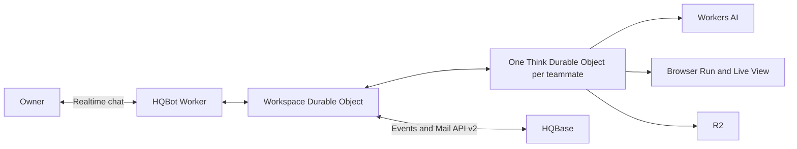
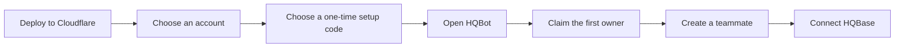

<p align="center">
  <strong>HQBot</strong>
</p>

<h1 align="center">Self-hosted AI teammates on Cloudflare</h1>

<p align="center">
  Chat with AI teammates, give them real work, watch their browser, and approve actions before they
  send anything.
</p>

<p align="center">
  <a href="https://deploy.workers.cloudflare.com/?url=https%3A%2F%2Fgithub.com%2FHQBase%2Fhqbot">
    
  </a>
</p>

HQBot is a separate AGPL-licensed repository. It is not affiliated with xAI, X, or Grok Bot. It
uses no proprietary code or assets.



## What it does

- Keeps each teammate's chat, memory, skills, files, routines, and task history.
- Lets one teammate delegate bounded, read-only work to active peers with `@Name`.
- Answers simple chat directly. It opens browser tools only when the request needs research.
- Runs durable work with Think fibers, Agent task queues, and Agent schedules.
- Uses GLM-5.3 Flash first, with DeepSeek V4 Flash as a fallback.
- Shows the real Browser Run tab through Live View. It does not reload a screenshot each second.
- Receives HQBase mail in realtime through the existing event and Mail API v2 interfaces.
- Pauses before an HQBase reply and waits for the owner to approve or reject it.
- Shows estimated model and browser cost by task, teammate, and overall use, plus raw Durable
  Object, Agent schedule, task, R2 file, and shared realtime footprints.
- Archives safely: active work stops, routines pause, and the HQBase connection is removed.

HQBot does not use Cloudflare Workflows or cron triggers. HQBase remains the mail system. HQBot does
not copy its mail storage or delivery code.

## Install



Select **Deploy to Cloudflare**, choose your Cloudflare account, and choose a private setup code of
at least 24 characters. Open the deployed address and use that code once to claim the owner name
and password. Later visits use the owner account and a secure HTTP-only cookie. Normal sign-in does
not use a login token.

To connect mail, give one teammate your HQBase workspace URL and a mailbox agent credential with
the smallest access that the job needs. HQBot encrypts the credential before it stores it.

See [Install HQBot](docs/install.md) for the short setup guide.

## Cost view

HQBot records Workers AI token use, Cloudflare-reported Quick Action time, and complete reusable
Browser Run session time. The totals are estimates, not a copy of the Cloudflare bill. Direct chat
without a task ID still counts under the teammate and the overall daily total. See
[Cost estimates](docs/costs.md).

## Release gate

A revision is not complete until every item passes:

- [ ] Local quality checks and the Cloudflare dry run pass.
- [ ] A clean Git SHA is deployed and shown by the live service.
- [ ] First-owner setup, login, realtime chat, and Live View work on Cloudflare.
- [ ] Cost estimates appear after real model and browser use.
- [ ] A real inbound HQBase email wakes HQBot, starts Browser Run research, pauses for approval, and
      sends one useful reply through HQBase after approval.

The last item must use the deployed service. Mocks do not count.

## Develop

```sh
pnpm install
pnpm cf:typegen
pnpm dev
```

Run the HQBase-style gates before each deploy:

```sh
pnpm check
pnpm deploy:dry-run
```

Read [How HQBot fits together](docs/architecture.md), [Privacy and safety](docs/privacy.md), and
[Maintain HQBot](docs/maintaining.md) before a release.

## License

HQBot is available under AGPL-3.0-only. See [LICENSE](LICENSE).
