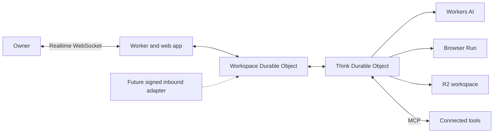
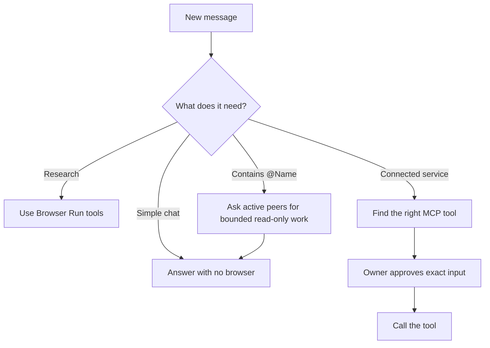
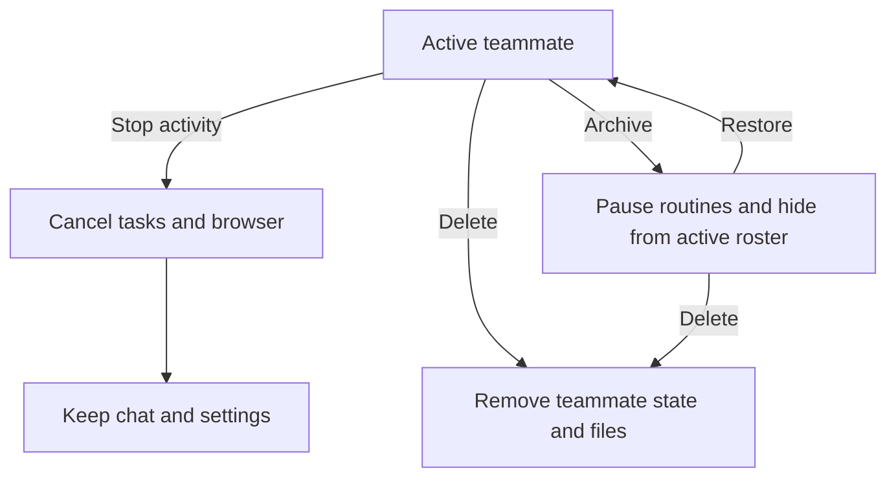

# How HQBot fits together

HQBot is a separate AGPL repository. It runs in the owner's Cloudflare account.

The workspace Durable Object owns the first owner, sessions, teammate list, tasks, and cost
summaries. Each teammate has one Think Durable Object for chat, memory, MCP connections, tools,
files, routines, and durable turn state.

## How a turn runs

Think fibers keep long turns durable. Agent task queues run background work. Agent schedules run
routines and clean up browser sessions.

HQBot does not use Cloudflare Workflows or cron triggers.

MCP is the flexible tool boundary. A compatible server describes its own tools, so HQBot discovers
them without a built-in integration list. Inbound triggers are different and are not included
today. A future signed webhook or channel adapter must validate the sender, stop replays, and map
the event to a teammate task.

## Teammate lifecycle

Stopping activity keeps the teammate. Deleting it is permanent and does not delete data in a
connected external service.

## Cloudflare services

| Need | Service |
| --- | --- |
| App and API | Workers and Static Assets |
| Realtime state | Agents and Durable Objects with SQLite |
| Durable teammate work | Think fibers, Agent queues, and Agent schedules |
| Model calls | Workers AI |
| Web research and Live View | Browser Run |
| Files and task artifacts | R2 |

Workers AI uses `@cf/zai-org/glm-5.3-flash` first. It falls back to
`@cf/deepseek-ai/deepseek-v4-flash-0731` when the first model cannot complete the call.
