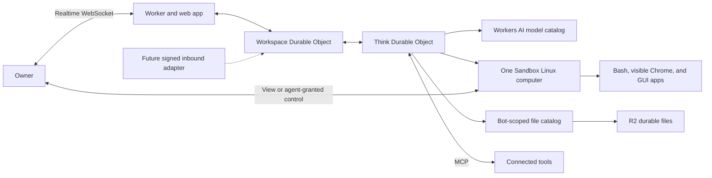
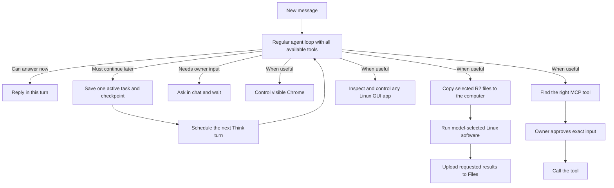
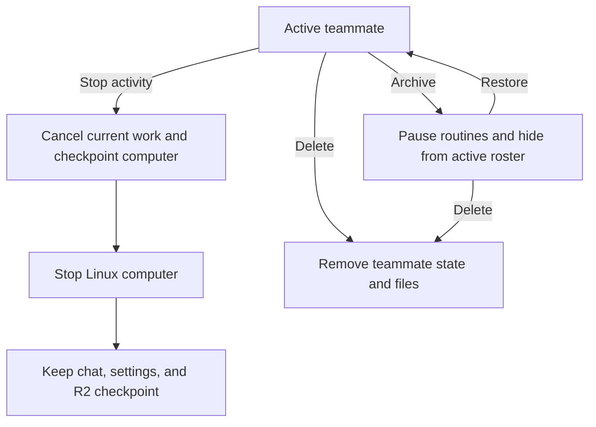
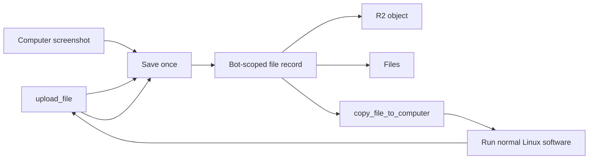

# How HQBot fits together

HQBot is a separate AGPL repository. It runs in the owner's Cloudflare account.

The workspace Durable Object owns the first owner, sessions, teammate list, task history, and cost
summaries. Each teammate has one Think Durable Object for chat, its current task, MCP connections,
tools, routines, and durable turn state. The teammate record controls current work. The workspace
task row is only a history and cost projection.

## How a turn runs

Every owner message starts as a normal Think turn. A reply, including normal tool use, does not
create a task. The model creates one active task only when the work must continue in a later turn,
wait until a future time, wait for a long Linux process, or wait for the owner. The task and its
compact checkpoint stay in the same teammate Durable Object as the conversation.

The `schedule` tool creates one-time or recurring future work. Think stores a one-time schedule as
the active task. It reconciles a recurring schedule from the teammate routine records into durable
scheduled turns.

HQBot keeps the complete merged Think tool set available on each normal turn. This includes the
teammate computer tools, `manage_task`, and `schedule`. HQBot does not apply a second
per-turn allow-list that can hide these controls.

After the agent gives computer control to the owner, it records a `needs_user` task before it ends
the turn. The saved task says what the agent must do after the owner replies. A temporary screen
disconnect does not surrender that durable owner-control lease. The UI reconnects and the owner can
continue the login.

Think fibers make each turn recoverable. A teammate has no step limit by default, so the model can
continue to use tools until it replies, waits, fails, or the owner stops it. The owner can set a
finite maximum number of model and tool rounds for each message in **Agent settings**.

Tool input is strict. HQBot does not silently rewrite a model's tool call. A rejected call returns
the expected field names and one valid example so the model can correct its next call.

If the owner sends a follow-up while a turn is running, HQBot stops that Think submission and
submits the follow-up as a new durable turn. The follow-up does not depend on the old browser chat
request staying open. A separate Stop action also cancels the current Think submission and starts
retried computer cleanup.

Agent schedules wake later turns, run routines, and manage computer idle deadlines. Each scheduled
continuation uses one stable task ID and generation. A stale delivery does no work. The full
conversation stays in Think. The task checkpoint stores only the small state that the next turn
needs. The right sidebar shows the active one-time task, its wake time, and a cancel action.

Each teammate has one Linux computer. Bash commands, Chrome, and other Linux GUI applications run
in that computer and use the same workspace. Structured browser tools control the Chrome window
that the owner sees through the desktop. Desktop tools inspect the whole screen and control its
pointer and keyboard. The teammate starts the computer when work needs it, and the live screen
appears automatically. The only direct computer action in the app is **Maximize**.

The owner asks the teammate for control when a private step needs the keyboard or pointer. The
teammate grants control and later takes it back. HQBot pauses model browser, desktop, and Bash
actions while the owner has control or until the control lease expires.

HQBot does not use Cloudflare Workflows, Agent queues, or cron triggers.

MCP is the flexible tool boundary. A compatible server describes its own tools, so HQBot discovers
them without a built-in integration list. Inbound triggers are different and are not included
today. A future signed webhook or channel adapter must validate the sender, stop replays, and map
the event to a teammate task.

An external write changes a connected service. Examples include sending mail, creating an issue,
or changing a calendar event. Before each connected-service call, HQBot saves a receipt with a
stable execution key and marks the attempt as uncertain. After a successful call, it saves the
small result and marks the receipt as applied. A replay returns the saved result. If HQBot loses
the call before it knows the result, the receipt stays uncertain and blocks an automatic retry.
The owner can then check the service before making a new request.

## Teammate lifecycle

Stopping activity keeps the teammate. Deleting it is permanent and does not delete data in a
connected external service.

## Cloudflare services

| Need | Service |
| --- | --- |
| App and API | Workers and Static Assets |
| Realtime state | Agents and Durable Objects with SQLite |
| Durable teammate work | Think turn fibers and Agent schedules |
| Model calls | Workers AI |
| Bash, browser work, and GUI applications | One Sandbox computer per teammate |
| Visible Linux desktop | The same Sandbox computer through noVNC |
| Uploaded, captured, generated, and recovery files | Bot-scoped catalog and R2 |

Authentication secrets stay inside the browser or connected service. The agent does not search the
Sandbox filesystem for credentials and does not copy cookies, session tokens, browser profiles, or
passwords into task state, Files, logs, or other durable storage.

## Computer life and recovery

The teammate starts and stops the computer as work needs. HQBot uses an internal balanced policy.
After 30 idle minutes, it writes a best-effort checkpoint to R2 and stops the computer. The next
agent start restores that checkpoint before it starts computer tools. A Cloudflare host restart, a
deployment, an out-of-memory restart, a process failure, or an agent stop can also end the running
computer.

A checkpoint can restore saved workspace files, application data from the saved home directory,
and the Chrome profile and tabs as closely as possible. It cannot restore process memory, a running
shell process, unsaved application state, or the exact placement and state of every GUI window. If
the computer has not stopped, the open desktop remains exact because it is still the same running
computer.

Every Bash call uses one durable execution path. Before HQBot starts the command, it saves a stable
process ID, task checkpoint, and recovery schedule in the teammate Durable Object. It then starts
that named process once. A quick command can finish in the same Think turn. If the command is still
running, or the Think connection ends, the saved execution becomes an active task. HQBot keeps a
short live wait for normal completion and resumes the agent as soon as the process exits. An Agent
schedule polls the same process without calling the model if the live wait ends, the Durable Object
is evicted, or a deployment interrupts it. The computer idle lease cannot stop an active process.
When the process ends, HQBot saves its result and starts one new bounded Think turn. The model can
then inspect the result and call `upload_file` for each requested deliverable.

The process ID comes from the tool call, so recovery adopts the same Sandbox process. It does not
start a second copy. If the saved process cannot be found for five checks and its result is unknown,
HQBot marks the task as uncertain and does not run the command again automatically.

The model does not choose foreground or background execution. **Stop** first saves a cancelling
state, cancels the Think submission, and then stops the process group. The `stop_process` tool uses
the same durable cancellation path without cancelling the Think turn that called it. A failed stop
is retried by an Agent schedule. Temporary-file cleanup is best effort and cannot delay computer
shutdown. A detached monitor loop is rejected with a recurring `schedule` example. A repeated
identical failed Bash call is rejected until the model changes its input.

Durable Object startup does only local migration and registration work. It schedules recovery
instead of waiting for Sandbox or network calls inside startup. Recovery checks saved task and
process IDs. It never repeats an external write whose receipt is applied or uncertain.

The computer view reports observed CPU, memory, disk, and uptime. HQBot combines computer time with
current Cloudflare rates to show an estimated cost. These readings help the owner manage one
teammate. They are not Cloudflare account telemetry or a bill.

## How files stay available

Chat messages contain small file references, not R2 keys or base64 image data. The Worker checks
the owner session and teammate ID before it copies a durable file to `/workspace/hqbot` on the
computer. Bash only runs a script. A file stays on the computer until the model calls `upload_file`
to save it in the bot-scoped catalog and R2. `list_files` lists durable files. `delete_file` removes
a durable file. The Linux disk is temporary, and R2 remains the durable source.

The model selector reads the current Workers AI catalog and shows non-experimental text-generation
models that advertise function calling. HQBot needs function calling for its computer, files, and
connected tools. It uses `@cf/zai-org/glm-5.3-flash` by default and falls back to that model when
another selected model cannot complete a call.
