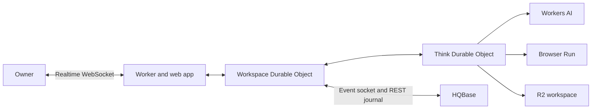
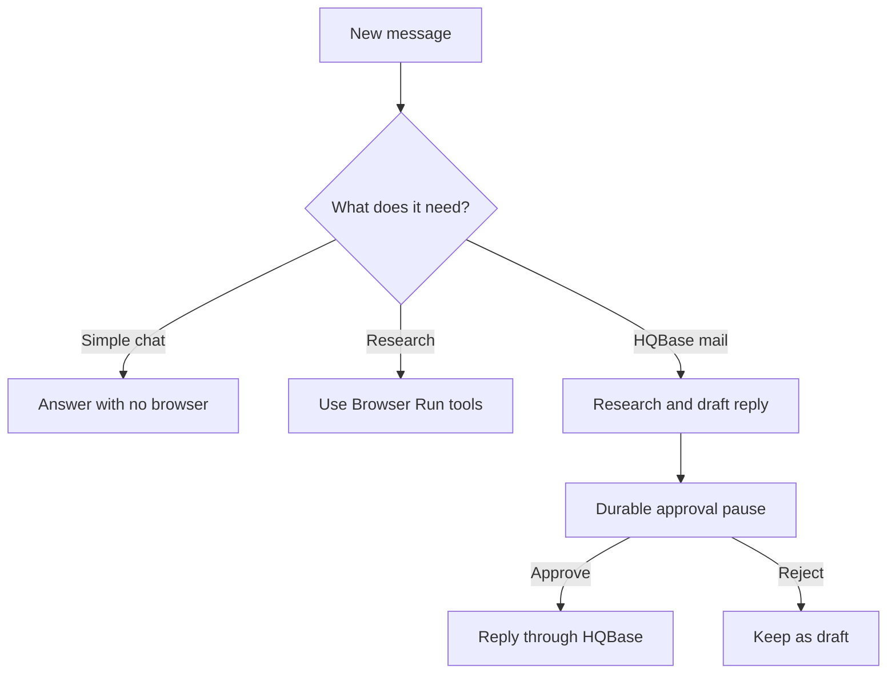

# How HQBot fits together

HQBot is a separate AGPL repository. It runs in the owner's Cloudflare account. HQBase remains the
mail system.

The workspace Durable Object owns the first owner, sessions, teammate list, HQBase connections,
mail tasks, and cost summaries. Each teammate has one Think Durable Object for chat, memory, tools,
files, routines, and durable turn state.

## How a turn runs

Think fibers keep long turns durable. Agent task queues move inbound mail into the correct
teammate. Agent schedules renew HQBase event access, retry a connection, run routines, and clean up
browser sessions.

HQBot does not use Cloudflare Workflows or cron triggers.

## Cloudflare services

| Need | Service |
| --- | --- |
| App and API | Workers and Static Assets |
| Realtime state | Agents and Durable Objects with SQLite |
| Durable teammate work | Think fibers, Agent queues, and Agent schedules |
| Model calls | Workers AI |
| Web research and Live View | Browser Run |
| Files and task artifacts | R2 |

Workers AI uses `@cf/zai-org/glm-5.3-flash` first. It falls back to
`@cf/deepseek-ai/deepseek-v4-flash-0731` when the first model cannot complete the call.
