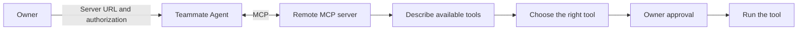
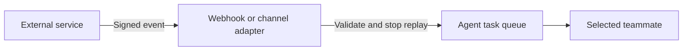

# Connect tools

A remote MCP server gives a teammate tools. In **Connections**, choose a service from the catalog,
check its setup note, and select **Add connection**. Complete **Authorize** when the service asks.
You can also enter a custom server URL. Add a bearer token when the service needs one. The teammate
discovers the server's tools at run time. The catalog links each provider's official setup guide.

Remote tool descriptions are untrusted. Each MCP call requires owner review unless an explicit
permission rule allows the matching action and input. A server's read-only label does not grant
authority. Scope rules and connected-service permissions both apply.

The model receives the Code Mode SDK's discovery API and available connector names. It uses
`codemode.search` and `codemode.describe` before it calls a remote method. Discovery does not need
approval. Each script must return its result explicitly so the model can read it. An approved remote
call resumes the saved execution automatically.

## Catalog and custom servers

The catalog offers setup entries for Cloudflare Docs, GitHub, Notion, Linear, Sentry, Atlassian Rovo,
Stripe, and Slack. Compatibility still comes from MCP. A compatible custom remote server can work
without a product-specific code change. A catalog entry does not connect an account by itself.

Provider authentication requirements differ. GitHub can use a fine-grained token. Slack needs a
registered internal or published app and its authorized user token; it does not support automatic
client registration. HQBot stores credentials but never shows them again. Remove an existing
connection before replacing its credentials. Never paste credentials into the server URL.

## What about inbound events?

MCP tools are calls from the teammate to a service. They do not make service events wake HQBot.
Set up a signed generic, GitHub, or Slack trigger on an event routine in **Automations**. Each
adapter validates the sender and stops replay before queueing work. See [event setup](events.md).

Use the smallest token scope that the task needs. Disconnect a server when the teammate no longer
needs its tools.
