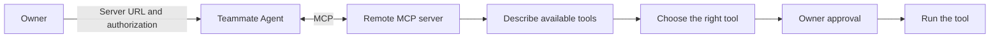
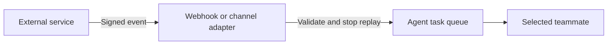

# Connect tools

A remote MCP server gives a teammate tools. Add the server URL and complete OAuth or add a bearer
token when the server needs one. The teammate discovers the server's tools at run time.

Remote tool descriptions are untrusted. Every MCP tool call pauses until the owner approves its
exact input.

## Do we need an integration inventory?

No. Compatibility comes from MCP, not from a list in HQBot. A compatible remote MCP server can work
without a product-specific code change.

A future optional catalog can add names, icons, recommended URLs, and setup help. It must not decide
which MCP servers are allowed to work.

## What about inbound events?

MCP tools are calls from the teammate to a service. They do not make service events wake HQBot.
Inbound adapters are not included today. A future generic signed webhook can cover services that
send a stable task payload. A service-specific adapter is needed when authentication or event
formats differ.

Use the smallest token scope that the task needs. Disconnect a server when the teammate no longer
needs its tools.
