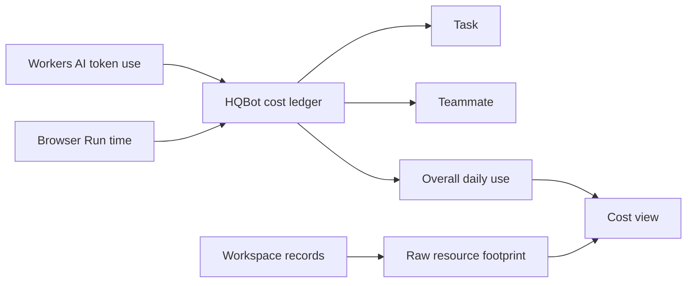

# Cost estimates

HQBot records two costs today:

| Service | Measured use | Estimate |
| --- | --- | --- |
| Workers AI | Input, cached input, output, and reasoning tokens | The configured model rates |
| Browser Run Quick Actions | Cloudflare's `X-Browser-Ms-Used` value | The configured hourly rate |
| Browser Run sessions | Open session time through close or timeout | The configured hourly rate |

The cost panel separates Workers AI tokens from Browser Run seconds. It also shows the raw Durable
Object GB-seconds per day used by the shared outbound HQBase event connection. This raw number is
shown before Cloudflare account allowances because HQBot cannot read the owner's billing plan.

The same panel shows these raw counts for the selected teammate and the whole workspace:

| Resource | What HQBot counts |
| --- | --- |
| Durable Objects | One workspace object overall and one object for each teammate |
| Agent schedules | One browser sweep for each teammate plus each active routine |
| Tasks today | Tracked task submissions since 00:00 UTC |
| R2 files | Objects and bytes for files recorded by HQBot |

For queued work, HQBot groups the estimate by task, teammate, and overall daily use. A direct chat
that has no task ID still counts under its teammate and the overall total. Daily totals start at
00:00 UTC.

These numbers help the owner find expensive work. The raw counts come from HQBot records, not
Cloudflare account telemetry. They do not replace the Cloudflare bill, account allowances, or
Cloudflare spending controls. Durable Object requests and storage, Worker requests, and R2 prices
are not converted to dollars.

Reusable browser time includes the configured keep-alive period and Live View until the session
closes or times out. Cloudflare account allowances and concurrent-browser overages are not assigned
to one teammate, so the Cloudflare dashboard and bill stay authoritative.

Model and Browser Run prices can change. Update the rate table and its tests before a release when
Cloudflare changes a price.
