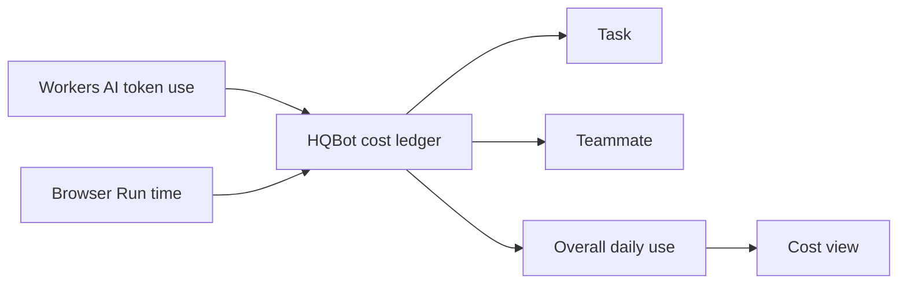

# Cost estimates

HQBot records two costs today:

| Service | Measured use | Estimate |
| --- | --- | --- |
| Workers AI | Input, cached input, output, and reasoning tokens | The configured model rates |
| Browser Run | Browser tool time in seconds | The configured hourly rate |

The cost panel separates Workers AI tokens from Browser Run seconds. It also shows the raw Durable
Object GB-seconds per day used by the shared outbound HQBase event connection. This raw number is
shown before Cloudflare account allowances because HQBot cannot read the owner's billing plan.

For queued work, HQBot groups the estimate by task, teammate, and overall daily use. A direct chat
that has no task ID still counts under its teammate and the overall total. Daily totals start at
00:00 UTC.

These numbers help the owner find expensive work. They do not replace the Cloudflare bill, account
allowances, or Cloudflare spending controls. Durable Object storage, requests, and R2 costs are not
converted to dollars in this ledger yet.

Model and Browser Run prices can change. Update the rate table and its tests before a release when
Cloudflare changes a price.
