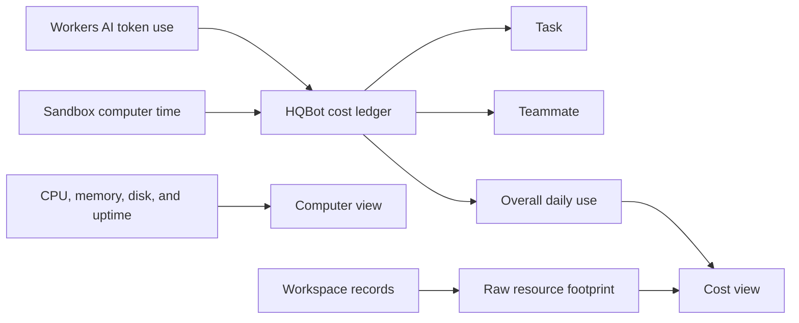

# Cost estimates

HQBot records two cost inputs today:

| Service | Measured use | Estimate |
| --- | --- | --- |
| Workers AI | Input, cached input, output, and reasoning tokens | Prices from the model catalog when available |
| Sandbox computer | Running and reserved computer time | Configured memory, disk, and CPU rates |

Chrome, Bash, and other GUI applications share the same Sandbox computer. HQBot does not add a
second browser-compute charge to its estimate. HQBot cannot read the owner's Cloudflare billing
plan, account allowances, or charges from connected services.

The computer panel shows the latest observed CPU, memory, disk, and uptime for one teammate. These
readings come from inside the computer. They help the owner find a full disk, high memory use, or a
long-running computer. They are not Cloudflare account telemetry.

The same panel shows these raw counts for the selected teammate and the whole workspace:

| Resource | What HQBot counts |
| --- | --- |
| Durable Objects | One workspace object overall and one object for each teammate |
| Agent schedules | Computer lifecycle work plus each active routine |
| Tasks today | Tracked task submissions since 00:00 UTC |
| R2 files | Saved files and bytes in the HQBot file catalog |

For queued work, HQBot groups the estimate by task, teammate, and overall daily use. A direct chat
that has no task ID still counts under its teammate and the overall total. Daily totals start at
00:00 UTC.

These numbers help the owner find expensive work. The raw counts come from HQBot records, not
Cloudflare account telemetry. They do not replace the Cloudflare bill, account allowances, or
Cloudflare spending controls. Durable Object requests and storage, Worker requests, R2 prices, and
connected service prices are not converted to dollars.

The computer estimate includes time through the managed 30-minute idle deadline. Continued agent
or owner activity extends that deadline. Stopping a computer ends new running-time estimates after
the stop completes. A recovery
checkpoint can add R2 storage, operation, and transfer use that the dollar estimate does not
include. The estimate also does not subtract Workers Paid allowances or add network, logs, Worker,
Durable Object, or connected-service charges. The Cloudflare dashboard and bill stay authoritative.
HQBot stops extending computer time when a configured HQBot daily cost budget is reached.

Model and Containers prices can change. HQBot refreshes supported model metadata from Workers AI
and uses catalog prices when they are available. A missing catalog price is shown as an unpriced
estimate rather than an invented charge. Check the current
[Workers AI prices](https://developers.cloudflare.com/workers-ai/platform/pricing/) and
[Containers prices](https://developers.cloudflare.com/containers/platform/pricing/).
