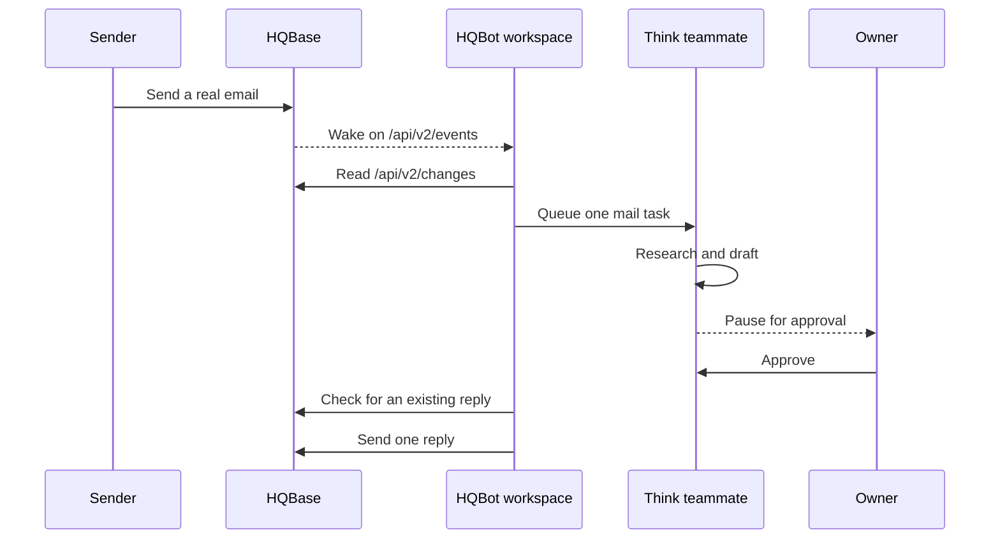

# HQBase mail connection

HQBase receives, stores, and sends mail. HQBot uses the existing HQBase API and does not copy its
mail infrastructure.

The event WebSocket is only a wake signal. The REST change journal is the source of truth. After a
wake or reconnect, an Agent queue drains the journal from the saved cursor. Agent schedules renew
the event lease and reconnect after a failure. There is no inbox cron job and no one-second poll.

This is an outgoing WebSocket, so the workspace Durable Object stays active while it is connected.
The cost panel shows its raw daily GB-second footprint before Cloudflare account allowances.

One HQBase connection belongs to one teammate. Use a mailbox agent credential with the smallest
access that the job needs. HQBot encrypts it with the installation key before storage.

An email reply is a durable approval action. If the owner approves it, HQBot checks the source
thread for an existing reply before it sends. This check stops a retry from sending the same reply
twice.

The event socket is not a webhook. Disconnecting HQBase stops new mail work but does not delete
mail from HQBase.
