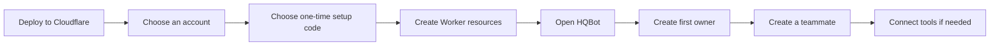

# Install HQBot

## What you need

- A Cloudflare Workers Paid account that can use Workers AI, Containers, and R2.
- A compatible remote MCP server if the teammate needs connected tools.

## Setup

1. Select **Deploy to Cloudflare** in the HQBot repository.
2. Choose your Cloudflare account and deploy the shown resources.
3. Choose a private one-time setup code of at least 24 characters when the deploy form asks for it.
4. Open the new HQBot address.
5. Use the setup code once. Create the owner with a name and a password of at least 12 characters.
6. Create a teammate.
7. To add tools, open **Connect**, then enter the remote MCP server URL and its required
   authorization.

The setup code prevents another visitor from claiming a new installation. HQBot uses it only for
the first owner claim. HQBot stores a password hash, not the password. Login uses a secure
HTTP-only cookie and limits repeated failures. Normal sign-in does not use the setup code.

The deploy contains the Worker, Static Assets, three Durable Object classes, Workers AI, one
on-demand Sandbox computer for each active teammate, Worker Loader, R2, and version metadata
bindings. Each computer can run Bash, visible Chrome, and other Linux GUI applications. R2 stores
saved files and best-effort computer recovery checkpoints.

## Install proof

Do not call the install path complete until the button works from a clean Cloudflare account, a
deployed teammate controls visible Chrome in its computer, and the teammate completes one useful
task through a real remote MCP server. See the release checklist in the
[README](../README.md#release-gate).
