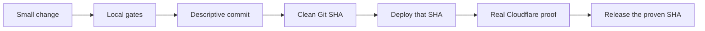

# Maintain HQBot



Use small commits so each live change is easy to inspect and undo.

## Local gates

```sh
pnpm check
pnpm deploy:dry-run
```

Run `pnpm cf:typegen` after a `wrangler.jsonc` change. A schema change needs a new ordered
migration, a fresh-install test, and an update test.

The quality gate checks format, lint, types, Node unit tests, Worker integration tests, coverage,
file size, and the production build. A source file over 300 lines needs review. A source file over
400 lines fails the gate.

## Git and deploy rules

- Keep one focused branch.
- Make one clear change per commit.
- Put a migration and its tests in the same commit.
- Do not deploy a dirty tree.
- Tag the Worker version with the exact Git SHA.
- If code changes after live proof, deploy and prove the new SHA again.

For live proof, connect a dedicated remote MCP server and complete one useful tool-backed task.
Record only safe IDs, times, the Git SHA, Worker version, source links, and cost estimate. Do not
record credentials, prompts, or tool results.

Keep HQBot documentation in this repository. Do not add HQBot copy to HQBase public documentation,
the HQBase website, or HQBase marketing pages.
