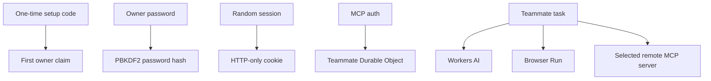

# Privacy and safety

HQBot runs in the owner's Cloudflare account. It sends task context needed for model and browser
work to the bound Cloudflare services. It sends tool call data only to the remote MCP servers that
the owner connects.

- Only a visitor with the one-time setup code can create the owner account.
- Passwords are hashed. Session values are stored as hashes and sent in HTTP-only, SameSite cookies.
- Repeated login failures are limited before another password derivation runs.
- HQBot stores MCP connection state and authorization in the teammate Agent's Cloudflare durable
  state.
- Prompts, webpages, inbound events, and tool results are untrusted input. They cannot add a
  connection or grant a permission.
- A future inbound adapter must validate the sender and stop replayed events before it creates work.
- Browser Run has full page control. Keep sensitive accounts signed out unless you intend the
  teammate to use them. Website actions do not have a general approval gate today.
- Product logs must contain metadata only. They must not contain credentials, prompts, or tool
  results.

Disconnecting an MCP server stops new tool calls to it. Deleting a teammate removes its HQBot state
and files. It does not delete data in a connected external service.

Security-sensitive behavior still needs Worker tests and deployed proof before a release.
