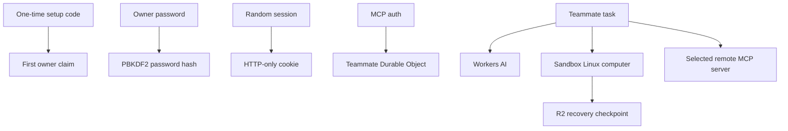

# Privacy and safety

HQBot runs in the owner's Cloudflare account. It sends task context needed for model and computer
work to the bound Cloudflare services. It sends tool call data only to the remote MCP servers that
the owner connects.

- Only a visitor with the one-time setup code can create the owner account.
- Passwords are hashed. Session values are stored as hashes and sent in HTTP-only, SameSite cookies.
- Repeated login failures are limited before another password derivation runs.
- HQBot stores MCP connection state and authorization in the teammate Agent's Cloudflare durable
  state.
- Prompts, webpages, inbound events, and tool results are untrusted input. They cannot add a
  connection or grant a permission.
- A future inbound adapter must validate the sender and stop replayed events before it creates work.
- Structured browser tools have full control of Chrome. Desktop tools send whole-desktop
  screenshots to the selected Workers AI model and control the pointer and keyboard in any visible
  Linux application. Keep sensitive accounts and applications closed or signed out unless you
  intend the teammate to use them. Computer actions do not have a general approval gate today.
- Ask the teammate for computer control before you enter a password, passkey, MFA code, or CAPTCHA.
  The teammate can also offer control when it needs a private login step. New model browser,
  desktop, and Bash actions pause while owner control is active. HQBot stops an active model
  browser or desktop controller. A Bash process or GUI application that already runs can continue.
  Tell the teammate when you finish so it can take control back. Do not put these secrets in chat.
- The teammate can copy a selected bot-scoped R2 file to its Linux computer. The computer can also
  contain scratch files and application data from earlier work. It receives no Cloudflare or
  MCP credentials. Public Internet access supports normal Linux tools and GUI applications. Treat
  scripts and downloaded content as untrusted input.
- The desktop uses that same Linux computer. It appears automatically when the teammate starts the
  computer. It has no public VNC endpoint. The owner session protects its same-origin WebSocket.
- Recovery checkpoints can contain workspace files, Chrome history, cookies, and other application
  data. HQBot stores them in the owner's R2 bucket. A deleted teammate's checkpoint is part of the
  teammate data that HQBot removes.
- A checkpoint is not an exact VM snapshot. It does not save process memory, running commands,
  unsaved application state, or the exact state of every GUI window.
- Product logs must contain metadata only. They must not contain credentials, prompts, or tool
  results.

Disconnecting an MCP server stops new tool calls to it. Deleting a teammate removes its HQBot state
and files. It does not delete data in a connected external service.

Security-sensitive behavior still needs Worker tests and deployed proof before a release.
