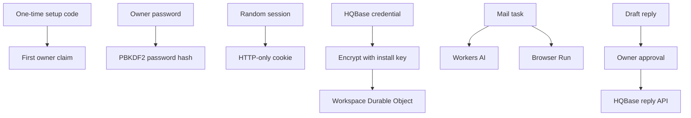

# Privacy and safety

HQBot runs in the owner's Cloudflare account. Connected mail stays in HQBase. HQBot sends only the
task context needed for model and browser work to the bound Cloudflare services.

- Only a visitor with the one-time setup code can create the owner account.
- Passwords are hashed. Session values are stored as hashes and sent in HTTP-only, SameSite cookies.
- Repeated login failures are limited before another password derivation runs.
- HQBase credentials are encrypted before Durable Object storage.
- Email and webpage text are untrusted input. They cannot approve a reply or add a permission.
- HQBase replies pause until the signed-in owner approves them.
- HQBot checks the source thread again before each send attempt.
- Browser Run has full page control. Keep sensitive accounts signed out unless you intend the
  teammate to use them. Website actions do not have a general approval gate today.
- Product logs must contain metadata only. They must not contain credentials or mail content.

Disconnecting a teammate stops new HQBase work. Removing HQBot data does not delete mail from the
HQBase workspace.

Security-sensitive behavior still needs Worker tests and the deployed real-email proof before a
release.
