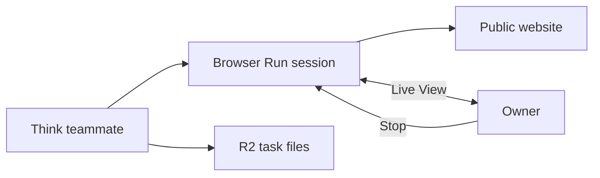

# Shared computer

The shared computer is a real Browser Run tab. Live View lets the owner watch and control that tab.
It is not a screenshot that refreshes each second.

HQBot opens browser tools only when a task needs web research. Live View opens only when the owner
selects **Live**. The **Stop** action closes the browser session, which stops more Browser
Run time from this session.

The current browser tools are for research and page control. Keep sensitive accounts signed out
unless you intend the teammate to use them. HQBot does not add a general approval gate to website
actions today.

R2 holds teammate files and review artifacts. The live stream is not saved as a video.

The current shared computer is a browser, not an Ubuntu desktop. A full Linux desktop can be a
future option after the browser path and its cost controls pass live proof.
