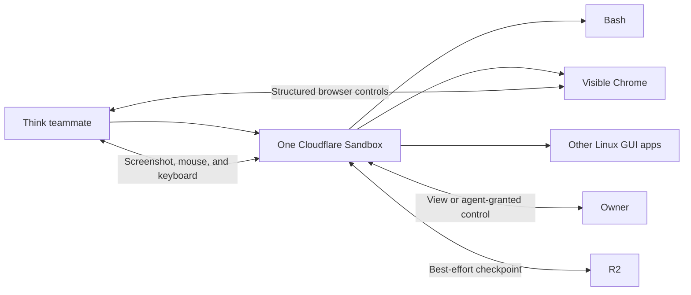

# Teammate computer

Each teammate has one private Linux computer. Bash, Chrome, and other Linux GUI applications run
inside that same Cloudflare Sandbox. They share the same workspace, files, network, processes, and
resource limits.

Structured browser tools read controls, click them, type, and press keys in the Chrome window that
appears in the desktop. This is not a second browser or a stream of separate screenshots. The owner
and the teammate see the same page, tabs, cookies, downloads, and browser profile.

Desktop tools capture the whole visible desktop and control its pointer and keyboard. The teammate
can use these tools with Chrome, the terminal, and other Linux GUI applications.

## Owner control

The teammate starts the computer when work needs it. The live screen then appears automatically in
the Computer view. The screen is view-only, and **Maximize** is the only direct computer action.

Ask the teammate when you need the keyboard and pointer. The teammate grants control. It can also
offer control when you must complete a login or another private step. Tell the teammate when you
finish, and it takes control back. HQBot pauses new model browser, desktop, and Bash actions while
owner control is active. A short control lease also expires if the desktop disconnects, so an
abandoned browser tab does not block the teammate forever.

Use owner control to enter a password, passkey, MFA code, or CAPTCHA. Do not send these secrets in
chat. The live desktop is not saved as a video.

Owner control stops an active structured Chrome or model desktop controller. It does not stop a
Bash process or GUI application that was already running when the teammate granted control.

## Computer life

The teammate starts and stops the computer as work needs. HQBot uses one internal balanced policy.
It creates a best-effort checkpoint and stops the computer after 30 idle minutes. Activity from
Bash, structured browser controls, model desktop controls, and owner control renews the idle
deadline.

Cloudflare can restart a host or replace a container during a deployment. An out-of-memory restart,
a process failure, an agent stop, or teammate deletion can also end the computer. Recovery
checkpoints protect saved state during normal maintenance and failures.

## Recovery

Before a managed sleep or stop, HQBot saves a compressed best-effort checkpoint in the owner's R2
bucket. When the teammate next starts the computer, HQBot restores the latest valid checkpoint
before it starts computer tools.

Recovery can restore:

- saved workspace files;
- application data in the saved workspace and home directories;
- the Chrome profile, cookies, history, and downloads; and
- Chrome tabs as closely as Chrome session recovery permits.

Recovery cannot restore:

- process memory or a running shell command;
- unsaved changes held only in application memory;
- the exact state and position of every GUI window; or
- a broken or incomplete checkpoint.

If the Sandbox remains alive, the desktop stays in its exact current state because it is still the
same running computer. After sleep or a restart, recovery starts a new computer from saved data.

## Files and resources

The `bash` tool runs normal commands in `/workspace/hqbot`. It does not move files. The model uses
`copy_file_to_computer` to copy a durable file from Files/R2 to the computer. It uses `upload_file`
to save a computer file in Files/R2 for the owner. `list_files` lists durable files, and
`delete_file` removes one.

Chrome accepts local files only as absolute `file:///` URLs. The computer rejects an existing bare
file path and returns one correct example instead of letting Chrome treat the path as a website.
For example, use `file:///workspace/hqbot/report.html`, not `report.html`.

Every command first gets a durable, stable Sandbox process ID. A quick command returns in the same
AI turn. A longer command keeps the same process and continues as a task. The command runner writes
one atomic completion record beside the temporary run files. A short live wait resumes the agent
when the process exits. An Agent schedule reads the completion record before it checks the Sandbox
process handle. This lets HQBot recover a finished command after the handle is no longer available.
If neither result is available, HQBot retries five checks and then shows the last recovery error.

Computer files remain in `/workspace/hqbot` until the temporary computer is removed. The model does
not select a foreground or background mode. **Stop** saves cancellation before it terminates the
process group. The model can call `stop_process` in a later turn when it must end a known process.
Temporary-file cleanup cannot delay computer shutdown. Bash is for bounded work. Repeated
monitoring uses a recurring schedule, not a detached shell loop.

The computer view shows current CPU, memory, disk, uptime, and estimated cost. These are
computer-level readings and HQBot estimates. The Cloudflare dashboard and bill stay authoritative.

The computer has no public VNC endpoint. An authenticated owner session protects its same-origin
WebSocket. It receives no Cloudflare or MCP credentials. Public Internet access supports normal
Linux tools, Chrome, and GUI applications. Treat downloaded programs and content as untrusted.
